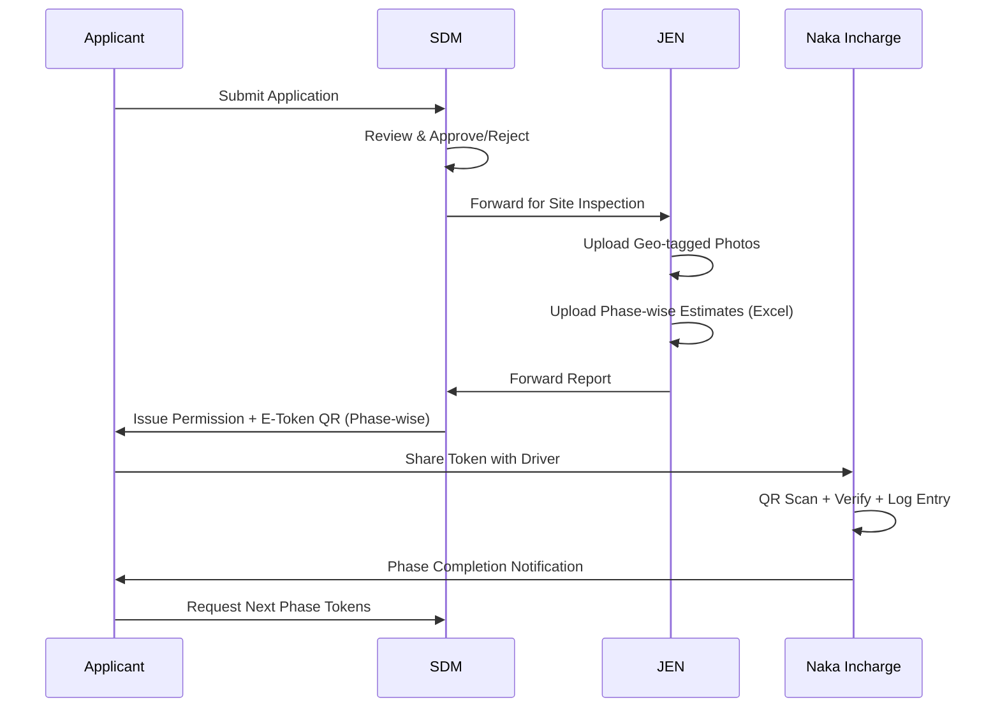
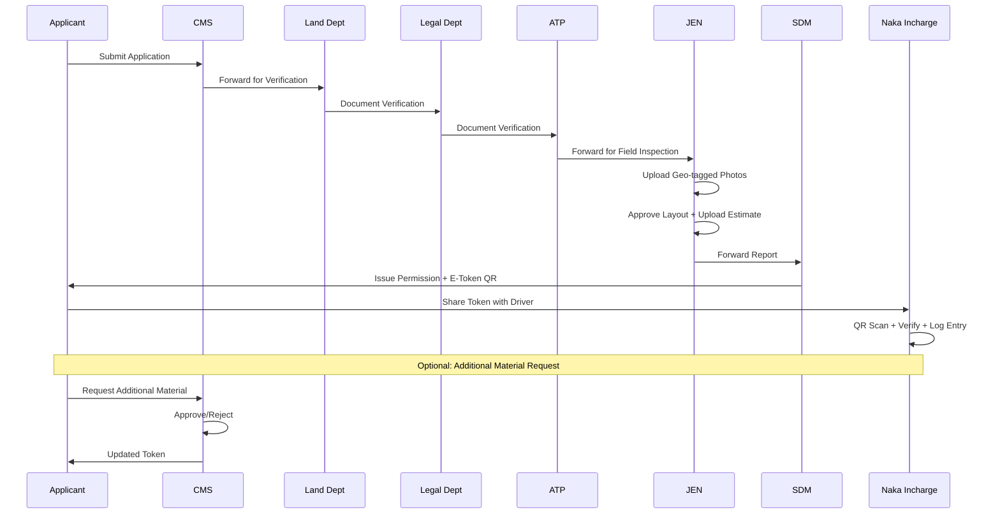

# Product Requirements Document (PRD)
## Mount Abu E-Token Management System
### Smart Digital Token Allocation for New Construction & Renovation

---

**Document Version:** 1.0  
**Created:** January 18, 2026  
**Status:** Draft  

---

## Table of Contents
1. [Executive Summary](#1-executive-summary)
2. [Problem Statement](#2-problem-statement)
3. [Product Vision & Goals](#3-product-vision--goals)
4. [User Personas & Roles](#4-user-personas--roles)
5. [System Architecture](#5-system-architecture)
6. [Functional Requirements](#6-functional-requirements)
7. [Non-Functional Requirements](#7-non-functional-requirements)
8. [API Specifications](#8-api-specifications)
9. [Security & Fraud Prevention](#9-security--fraud-prevention)
10. [Reporting & Analytics](#10-reporting--analytics)
11. [Implementation Phases](#11-implementation-phases)

---

## 1. Executive Summary

The **Mount Abu E-Token Management System** is a comprehensive digital platform designed for the Mount Abu Municipal Council to streamline and digitize the process of construction material token allocation for new construction and renovation projects.

### Key Components:
- **Public Website**: Information portal, tourism promotion, and service entry point
- **Admin Dashboard**: Central operational system for authorities
- **Mobile Application**: Citizen and field authority access (Android & iOS)

### Core Value Propositions:
- Eliminate paper-based token systems
- Real-time tracking and transparency
- Geo-tagged verification for construction sites
- Automated token generation based on approved estimates
- Multi-authority workflow with time-bound processing

---

## 2. Problem Statement

### Current Challenges:
1. **Manual Token Processing**: Paper-based tokens are prone to fraud and duplication
2. **Lack of Transparency**: Citizens have no visibility into application status
3. **No Material Tracking**: Difficult to verify actual material delivery vs approved quantities
4. **Delayed Processing**: No time-bound accountability for authorities
5. **Data Silos**: Fragmented information across departments
6. **Verification Challenges**: No geo-tagged proof of site inspections

### Target Outcomes:
- 100% digital token allocation
- Real-time application tracking
- Fraud detection through geo-tagging and QR verification
- Reduced processing time by 60%
- Complete audit trail for all transactions

---

## 3. Product Vision & Goals

### Vision Statement
*"To create a transparent, efficient, and fraud-resistant digital ecosystem for construction material token management that serves both citizens and government authorities."*

### Goals
| Goal | Metric | Target |
|------|--------|--------|
| Digitization | % of tokens issued digitally | 100% |
| Processing Time | Average application processing | < 7 days |
| User Satisfaction | Citizen feedback score | > 4.5/5 |
| Fraud Reduction | Duplicate/invalid tokens detected | 95% detection rate |
| Authority Compliance | Time-bound processing adherence | > 90% |

---

## 4. User Personas & Roles

### 4.1 Applicants (Citizens)

| Attribute | Description |
|-----------|-------------|
| **Profile** | Property owners, contractors, builders |
| **Access** | Mobile App, Website |
| **Authentication** | Mobile OTP + Aadhaar verification |
| **Key Actions** | Apply for tokens, track status, share tokens with drivers |

### 4.2 Government Authorities

#### Hierarchy & Roles

```
┌─────────────────────────────────────────────────────────────┐
│                          SDM                                │
│    (Sub-Divisional Magistrate - Final Authority)            │
│    • Approval/Rejection of new construction files           │
│    • Grant E-Tokens (automated based on JEN estimate)       │
└─────────────────────────────────────────────────────────────┘
                              │
          ┌───────────────────┼───────────────────┐
          ▼                   ▼                   ▼
┌─────────────────┐  ┌─────────────────┐  ┌─────────────────┐
│   CMS (UIT)     │  │   CMS (ULB)     │  │      JEN        │
│ Commissioner    │  │ Commissioner    │  │ Junior Engineer │
│ Urban Improv.   │  │ Urban Local     │  │                 │
│                 │  │ Body            │  │ • Site photos   │
│ • Renovation    │  │ • Renovation    │  │ • Estimates     │
│   approval      │  │   approval      │  │ • Layout        │
│ • Additional    │  │ • Additional    │  │   approval      │
│   material      │  │   material      │  │                 │
└─────────────────┘  └─────────────────┘  └─────────────────┘
          │                   │                   │
          └───────────────────┼───────────────────┘
                              │
          ┌───────────────────┼───────────────────┐
          ▼                   ▼                   ▼
┌─────────────────┐  ┌─────────────────┐  ┌─────────────────┐
│      Land       │  │     Legal       │  │      ATP        │
│                 │  │                 │  │ (Town Planning) │
│ • Document      │  │ • Document      │  │ • Document      │
│   verification  │  │   verification  │  │   verification  │
│ • Checklist     │  │ • Checklist     │  │ • Checklist     │
│ • Comments      │  │ • Comments      │  │ • Comments      │
└─────────────────┘  └─────────────────┘  └─────────────────┘
                              │
                              ▼
┌─────────────────────────────────────────────────────────────┐
│                     Naka Incharge                           │
│    • QR scan at checkpoints                                 │
│    • Vehicle, material, photo verification                  │
│    • Entry logging with geo-tags                            │
└─────────────────────────────────────────────────────────────┘
```

#### Authority Authentication
| Role | Method |
|------|--------|
| All Authorities | Static Email/Password + Mobile OTP |
| Applicants | Mobile OTP + Aadhaar |

---

## 5. System Architecture

### 5.1 Platform Distribution

| Platform | Users | Purpose |
|----------|-------|---------|
| **Web App** | Government Authorities | Dashboard operations |
| **Android App** | Applicants, Field Authorities | Token applications, scanning |
| **iOS App** | Applicants, Field Authorities | Token applications, scanning |
| **Website** | Public | Information, tourism |

### 5.2 High-Level Architecture

```
┌─────────────────────────────────────────────────────────────────────┐
│                         CLIENT LAYER                                 │
├─────────────────┬─────────────────┬─────────────────┬───────────────┤
│   Public        │   Admin         │   Android       │    iOS        │
│   Website       │   Dashboard     │   App           │    App        │
│   (React/Next)  │   (React)       │   (Flutter)     │   (Flutter)   │
└────────┬────────┴────────┬────────┴────────┬────────┴───────┬───────┘
         │                 │                 │                │
         └─────────────────┴─────────┬───────┴────────────────┘
                                     │
                              ┌──────▼──────┐
                              │   API       │
                              │   Gateway   │
                              └──────┬──────┘
                                     │
┌────────────────────────────────────┴────────────────────────────────┐
│                         API LAYER (RESTful)                          │
├─────────────────┬─────────────────┬─────────────────┬───────────────┤
│   Auth API      │   Application   │   Token API     │   Reports     │
│                 │   API           │                 │   API         │
└────────┬────────┴────────┬────────┴────────┬────────┴───────┬───────┘
         │                 │                 │                │
         └─────────────────┴─────────┬───────┴────────────────┘
                                     │
┌────────────────────────────────────┴────────────────────────────────┐
│                         SERVICE LAYER                                │
├─────────────────┬─────────────────┬─────────────────┬───────────────┤
│   Auth          │   Workflow      │   Notification  │   Analytics   │
│   Service       │   Engine        │   Service       │   Service     │
└────────┬────────┴────────┬────────┴────────┬────────┴───────┬───────┘
         │                 │                 │                │
         └─────────────────┴─────────┬───────┴────────────────┘
                                     │
┌────────────────────────────────────┴────────────────────────────────┐
│                         DATA LAYER                                   │
├─────────────────┬─────────────────┬─────────────────┬───────────────┤
│   PostgreSQL    │   Redis         │   S3/Object     │   Elastic     │
│   (Primary DB)  │   (Cache)       │   Storage       │   Search      │
└─────────────────┴─────────────────┴─────────────────┴───────────────┘
                                     │
┌────────────────────────────────────┴────────────────────────────────┐
│                      EXTERNAL INTEGRATIONS                           │
├─────────────────┬─────────────────┬─────────────────┬───────────────┤
│   SMS Gateway   │   WhatsApp      │   Aadhaar       │   Email       │
│   (MSG91)       │   Business API  │   Verification  │   (SMTP)      │
└─────────────────┴─────────────────┴─────────────────┴───────────────┘
```

---

## 6. Functional Requirements

### 6.1 Use Cases

#### Use Case 1: New Construction Token Allocation

**Workflow:**



**Deliverables to Applicant:**
- Permission Letter
- Permitted Estimate
- T&C Agreement
- Phase-wise E-Token QRs

#### Use Case 2: Renovation Token Allocation

**Workflow:**



### 6.2 Feature Specifications

#### 6.2.1 Applicant Features

| Feature | Description | Priority |
|---------|-------------|----------|
| Account Creation | OTP-based registration with Aadhaar | P0 |
| Form Fill-up | Dynamic form based on construction type & zone | P0 |
| Document Upload | Upload ownership and required documents | P0 |
| Terms & Conditions | Digital acceptance | P0 |
| Application Tracking | Real-time status with notifications | P0 |
| E-Token Sharing | Share tokens with drivers via QR/link | P0 |
| Quantity Tracking | View remaining material quantities | P0 |
| Notification Center | SMS/WhatsApp/Push notifications | P1 |

#### 6.2.2 Authority Features

| Feature | Description | Users | Priority |
|---------|-------------|-------|----------|
| File Queue | View pending applications | All | P0 |
| Document Viewer | View uploaded documents | All | P0 |
| Approval/Rejection | Process with comments | SDM, CMS | P0 |
| Checklist Verification | Verify against checklist | Land, Legal, ATP | P0 |
| Site Photo Upload | Geo-tagged photos | JEN | P0 |
| Estimate Upload | Excel-based material estimates | JEN | P0 |
| Layout Approval | Approve with comments | JEN | P0 |
| QR Scanner | Scan and verify tokens | Naka | P0 |
| Vehicle Entry Logging | Log with photos | Naka | P0 |
| Time-bound Alerts | SLA violation warnings | All | P1 |
| Performance Dashboard | Processing metrics | SDM, CMS | P1 |

#### 6.2.3 Dashboard Features

| Feature | Description | Priority |
|---------|-------------|----------|
| Website CMS | Manage website content | P0 |
| User Management | Create/manage authority accounts | P0 |
| Report Generation | Multiple report types | P0 |
| Analytics Dashboard | Visual analytics | P1 |
| Audit Logs | Complete action history | P0 |
| Vehicle Entry Monitoring | Read-only view | P1 |

---

## 7. Non-Functional Requirements

### 7.1 Performance

| Metric | Requirement |
|--------|-------------|
| API Response Time | < 500ms (95th percentile) |
| Page Load Time | < 3 seconds |
| Concurrent Users | 1000+ |
| Uptime | 99.5% |

### 7.2 Security

| Requirement | Implementation |
|-------------|----------------|
| Data Encryption | AES-256 at rest, TLS 1.3 in transit |
| Authentication | JWT with refresh tokens |
| Authorization | Role-based access control (RBAC) |
| Audit | Complete action logging |
| Session Management | Secure session handling |

### 7.3 Scalability

- Horizontal scaling for API services
- CDN for static assets
- Database read replicas for reporting

### 7.4 Accessibility

- Bilingual support (English & Hindi)
- Mobile-first responsive design
- WCAG 2.1 AA compliance target

---

## 8. API Specifications

### 8.1 API Categories

```
/api/v1/
├── auth/                    # Authentication & Authorization
│   ├── POST /login          # User login (OTP/Password)
│   ├── POST /verify-otp     # OTP verification
│   ├── POST /refresh        # Token refresh
│   ├── POST /logout         # Session termination
│   └── POST /aadhaar-verify # Aadhaar verification
│
├── users/                   # User Management
│   ├── GET /profile         # Get user profile
│   ├── PUT /profile         # Update profile
│   ├── GET /authorities     # List authorities (admin)
│   ├── POST /authorities    # Create authority (admin)
│   └── PUT /authorities/:id # Update authority (admin)
│
├── applications/            # Application Management
│   ├── POST /                # Create application
│   ├── GET /                 # List applications (with filters)
│   ├── GET /:id              # Get application details
│   ├── PUT /:id              # Update application
│   ├── POST /:id/documents   # Upload documents
│   ├── GET /:id/timeline     # Get application timeline
│   ├── POST /:id/approve     # Approve application
│   ├── POST /:id/reject      # Reject application
│   └── POST /:id/forward     # Forward to next authority
│
├── tokens/                  # E-Token Management
│   ├── GET /                 # List tokens (with filters)
│   ├── GET /:id              # Get token details
│   ├── GET /:id/qr           # Generate QR code
│   ├── POST /:id/share       # Share token
│   ├── POST /:id/scan        # Scan token (Naka)
│   ├── GET /:id/usage        # Token usage history
│   └── PUT /:id/status       # Update token status
│
├── estimates/               # Material Estimates
│   ├── POST /upload          # Upload Excel estimate
│   ├── GET /:applicationId   # Get estimates for application
│   ├── PUT /:id              # Update estimate
│   └── GET /:id/phases       # Get phase-wise breakdown
│
├── inspections/             # Site Inspections
│   ├── POST /                # Create inspection report
│   ├── GET /:applicationId   # Get inspections for application
│   ├── POST /:id/photos      # Upload geo-tagged photos
│   └── PUT /:id              # Update inspection report
│
├── naka/                    # Checkpoint Operations
│   ├── GET /entries          # List vehicle entries
│   ├── POST /entries         # Log vehicle entry
│   ├── GET /entries/:id      # Get entry details
│   └── POST /scan            # Scan and validate token
│
├── reports/                 # Reporting
│   ├── GET /applications     # Application reports
│   ├── GET /tokens           # Token usage reports
│   ├── GET /vehicles         # Vehicle entry reports
│   ├── GET /materials        # Material consumption reports
│   ├── GET /authority-performance # Authority SLA reports
│   └── POST /export          # Export reports (CSV/PDF)
│
├── notifications/           # Notifications
│   ├── GET /                 # List notifications
│   ├── PUT /:id/read         # Mark as read
│   └── PUT /read-all         # Mark all as read
│
├── content/                 # Website CMS
│   ├── GET /pages            # List pages
│   ├── PUT /pages/:id        # Update page content
│   ├── GET /notices          # List notices
│   ├── POST /notices         # Create notice
│   ├── GET /tenders          # List tenders
│   └── POST /tenders         # Create tender
│
├── blacklist/               # User Blacklist Management (NEW)
│   ├── GET /                 # List blacklisted users
│   ├── POST /:userId         # Blacklist user
│   ├── DELETE /:userId       # Remove from blacklist (whitelist)
│   └── GET /:userId/history  # Get rejection history
│
└── analytics/               # Dashboard Analytics
    ├── GET /overview         # System overview stats
    ├── GET /trends           # Time-based trends
    └── GET /performance      # Authority performance metrics
```

### 8.2 Core API Specifications

#### 8.2.1 Authentication APIs

```yaml
POST /api/v1/auth/login
Description: Initiate login process
Request Body:
  type: object
  properties:
    userType:
      type: string
      enum: [applicant, authority]
    identifier:
      type: string
      description: Mobile number for applicant, email for authority
    password:
      type: string
      description: Required only for authority login
Response:
  200:
    otpSent: boolean
    sessionId: string
  401:
    error: string
```

```yaml
POST /api/v1/auth/verify-otp
Description: Verify OTP and complete login
Request Body:
  type: object
  properties:
    sessionId: string
    otp: string
Response:
  200:
    accessToken: string
    refreshToken: string
    user: UserObject
  401:
    error: string
```

#### 8.2.2 Application APIs

```yaml
POST /api/v1/applications
Description: Create new application
Authorization: Bearer Token (Applicant)
Request Body:
  type: object
  properties:
    applicationType:
      type: string
      enum: [new_construction, renovation]
    zone:
      type: string
      enum: [UIT_DENSE, UIT_SCATTERED, ULB_DENSE, ULB_SCATTERED]
    propertyDetails:
      type: object
      properties:
        address: string
        plotNumber: string
        area: number
        ownerName: string
        ownerAadhaar: string
    estimatedMaterials:
      type: array
      items:
        type: object
        properties:
          materialType: string
          quantity: number
          unit: string
    documents:
      type: array
      items:
        type: string
        format: uuid
Response:
  201:
    applicationId: string
    status: SUBMITTED
    createdAt: datetime
```

```yaml
POST /api/v1/applications/:id/approve
Description: Approve application
Authorization: Bearer Token (SDM/CMS)
Request Body:
  type: object
  properties:
    comments: string
    conditions:
      type: array
      items: string
Response:
  200:
    applicationId: string
    status: APPROVED
    tokensGenerated: boolean
```

#### 8.2.3 Token APIs

```yaml
POST /api/v1/naka/scan
Description: Scan and validate token at checkpoint
Authorization: Bearer Token (Naka Incharge)
Request Body:
  type: object
  properties:
    tokenQR: string
    vehicleNumber: string
    materialType: string
    quantity: number
    unit: string
    photos:
      type: array
      items:
        type: object
        properties:
          base64: string
          latitude: number
          longitude: number
          timestamp: datetime
Response:
  200:
    valid: boolean
    entryId: string
    remainingQuantity: number
    applicantDetails: object
  400:
    valid: false
    reason: string
    enum: [EXPIRED, EXHAUSTED, INVALID, BLACKLISTED]
```

#### 8.2.4 Blacklist APIs

```yaml
GET /api/v1/blacklist/:userId/history
Description: Get user's rejection history
Authorization: Bearer Token (Authority)
Response:
  200:
    userId: string
    rejectionCount: number
    consecutiveRejections: number
    isBlacklisted: boolean
    blacklistedAt: datetime | null
    rejections:
      type: array
      items:
        type: object
        properties:
          applicationId: string
          rejectedAt: datetime
          rejectedBy: string
          reason: string
          authorityComments: string

POST /api/v1/blacklist/:userId/whitelist
Description: Whitelist a blacklisted user
Authorization: Bearer Token (SDM/CMS only)
Request Body:
  type: object
  properties:
    reason: string
    approvedBy: string
Response:
  200:
    userId: string
    whitelistedAt: datetime
    whitelistedBy: string
    reason: string
```

---

## 9. Security & Fraud Prevention

### 9.1 Application Rejection & Blacklisting System

> **Critical Feature**: Automatic blacklisting for repeated rejections to prevent abuse

#### 9.1.1 Blacklist Rules

```
┌─────────────────────────────────────────────────────────────────────┐
│                    AUTOMATIC BLACKLIST TRIGGER                       │
├─────────────────────────────────────────────────────────────────────┤
│                                                                      │
│   Condition: 3 CONSECUTIVE rejected applications                    │
│                                                                      │
│   ┌──────────┐    ┌──────────┐    ┌──────────┐    ┌──────────────┐ │
│   │ Reject 1 │───►│ Reject 2 │───►│ Reject 3 │───►│ AUTO         │ │
│   │          │    │          │    │          │    │ BLACKLISTED  │ │
│   └──────────┘    └──────────┘    └──────────┘    └──────────────┘ │
│                                                                      │
│   Note: Counter resets on successful approval                       │
│                                                                      │
└─────────────────────────────────────────────────────────────────────┘
```

#### 9.1.2 Blacklist Implementation

```typescript
interface BlacklistRule {
  consecutiveRejectionsThreshold: 3;
  blacklistDuration: "INDEFINITE"; // Until manually whitelisted
  whitelistAuthority: ["SDM", "CMS"]; // Only these can whitelist
  notificationChannels: ["SMS", "EMAIL", "PUSH"];
}

interface UserBlacklistStatus {
  userId: string;
  isBlacklisted: boolean;
  blacklistedAt: Date | null;
  consecutiveRejections: number;
  lastRejectionDate: Date | null;
  whitelistedBy: string | null;
  whitelistReason: string | null;
}
```

#### 9.1.3 Blacklist Workflow

```
┌─────────────────────────────────────────────────────────────────────┐
│                     BLACKLIST WORKFLOW                              │
└─────────────────────────────────────────────────────────────────────┘

Application Rejected
        │
        ▼
┌───────────────────────┐
│ Increment Consecutive │
│ Rejection Counter     │
└───────────┬───────────┘
            │
            ▼
    ┌───────────────┐
    │ Counter >= 3? │
    └───────┬───────┘
            │
      ┌─────┴─────┐
      │           │
      ▼           ▼
    [YES]       [NO]
      │           │
      ▼           ▼
┌─────────────┐ ┌─────────────┐
│ BLACKLIST   │ │ Continue    │
│ USER        │ │ Normal Flow │
└─────┬───────┘ └─────────────┘
      │
      ▼
┌─────────────────────────────────────────────────────────────────────┐
│ BLACKLISTED STATE:                                                  │
│ • Cannot submit new applications                                    │
│ • Existing approved tokens remain valid                             │
│ • SMS/Email notification sent with reason                           │
│ • Dashboard shows "Blacklisted" status clearly                      │
│ • Must visit government office for whitelist request                │
└─────────────────────────────────────────────────────────────────────┘
      │
      ▼
┌─────────────────────────────────────────────────────────────────────┐
│ WHITELIST PROCESS (Manual by SDM/CMS):                              │
│ 1. User submits offline request with documentation                  │
│ 2. Authority reviews rejection history                              │
│ 3. In-person verification if required                               │
│ 4. Authority approves whitelist with reason                         │
│ 5. User receives notification + can submit applications again       │
│ 6. Consecutive rejection counter resets to 0                        │
└─────────────────────────────────────────────────────────────────────┘
```

#### 9.1.4 Database Schema for Blacklist

```sql
-- User Blacklist Status Table
CREATE TABLE user_blacklist_status (
    id UUID PRIMARY KEY DEFAULT gen_random_uuid(),
    user_id UUID NOT NULL REFERENCES users(id),
    is_blacklisted BOOLEAN DEFAULT FALSE,
    consecutive_rejections INTEGER DEFAULT 0,
    total_rejections INTEGER DEFAULT 0,
    blacklisted_at TIMESTAMP,
    blacklist_reason TEXT,
    whitelisted_at TIMESTAMP,
    whitelisted_by UUID REFERENCES users(id),
    whitelist_reason TEXT,
    created_at TIMESTAMP DEFAULT CURRENT_TIMESTAMP,
    updated_at TIMESTAMP DEFAULT CURRENT_TIMESTAMP,
    UNIQUE(user_id)
);

-- Rejection History Table
CREATE TABLE application_rejections (
    id UUID PRIMARY KEY DEFAULT gen_random_uuid(),
    user_id UUID NOT NULL REFERENCES users(id),
    application_id UUID NOT NULL REFERENCES applications(id),
    rejected_by UUID NOT NULL REFERENCES users(id),
    rejection_reason TEXT NOT NULL,
    authority_comments TEXT,
    rejection_category VARCHAR(50), -- DOCUMENT_ISSUE, FRAUD, INCOMPLETE, OTHER
    rejected_at TIMESTAMP DEFAULT CURRENT_TIMESTAMP,
    was_consecutive BOOLEAN DEFAULT TRUE -- Reset on approval
);

-- Blacklist Audit Log
CREATE TABLE blacklist_audit_log (
    id UUID PRIMARY KEY DEFAULT gen_random_uuid(),
    user_id UUID NOT NULL REFERENCES users(id),
    action VARCHAR(20) NOT NULL, -- BLACKLIST, WHITELIST
    performed_by UUID REFERENCES users(id),
    reason TEXT NOT NULL,
    metadata JSONB,
    created_at TIMESTAMP DEFAULT CURRENT_TIMESTAMP
);

-- Indexes
CREATE INDEX idx_blacklist_user_id ON user_blacklist_status(user_id);
CREATE INDEX idx_blacklist_status ON user_blacklist_status(is_blacklisted);
CREATE INDEX idx_rejections_user_id ON application_rejections(user_id);
CREATE INDEX idx_rejections_date ON application_rejections(rejected_at);
```

### 9.2 Additional Fraud Prevention Measures

| Measure | Description |
|---------|-------------|
| **QR Code Expiry** | Tokens expire after specified date/quantity |
| **Geo-fencing** | Validate QR scans are within Mount Abu boundaries |
| **Photo Verification** | All photos must have geo-tags and timestamps |
| **Duplicate Detection** | Alert on similar applications from same property |
| **Vehicle History** | Track vehicle usage patterns for anomalies |
| **Quantity Alerts** | Alert when usage exceeds approved estimates |

### 9.3 Authority Accountability

| Control | Implementation |
|---------|----------------|
| **SLA Tracking** | Each authority has time limits per action |
| **Escalation** | Auto-escalate on SLA breach |
| **Audit Trail** | All actions logged with timestamp |
| **Performance Metrics** | Dashboard showing processing times |

---

## 10. Reporting & Analytics

### 10.1 Report Types

| Report | Granularity | Users |
|--------|-------------|-------|
| Application Status | Daily/Weekly/Monthly | All Authorities |
| Token Issuance | Daily/Weekly/Monthly | SDM, CMS |
| Vehicle Entry | Daily/Weekly/Monthly | SDM, Naka |
| Material Consumption | By Applicant/Type/Date | SDM, CMS |
| Authority Performance | Weekly/Monthly | SDM |
| Rejection Analysis | Weekly/Monthly | SDM, CMS |
| Blacklist Report | Monthly | SDM, CMS |

### 10.2 Analytics Dashboard Metrics

```
┌─────────────────────────────────────────────────────────────────────┐
│                    ANALYTICS DASHBOARD                              │
├─────────────────────────────────────────────────────────────────────┤
│                                                                     │
│  ┌──────────────┐  ┌──────────────┐  ┌──────────────┐  ┌──────────┐│
│  │ Applications │  │   Tokens     │  │   Vehicle    │  │ Material ││
│  │   Pending    │  │   Active     │  │   Entries    │  │ Consumed ││
│  │     127      │  │     453      │  │    1,247     │  │  45,678  ││
│  └──────────────┘  └──────────────┘  └──────────────┘  └──────────┘│
│                                                                    │
│  ┌──────────────────────────────────────────────────────────────┐  │
│  │           Processing Time by Authority (Avg Days)            │  │
│  │  ▓▓▓▓▓▓▓▓▓ SDM: 2.3                                          │  │
│  │  ▓▓▓▓▓▓▓▓▓▓▓▓ CMS: 3.1                                       │  │
│  │  ▓▓▓▓▓▓ JEN: 1.8                                             │  │
│  │  ▓▓▓▓ Land: 1.2                                              │  │
│  │  ▓▓▓▓▓ Legal: 1.5                                            │  │
│  │  ▓▓▓▓ ATP: 1.1                                               │  │
│  └──────────────────────────────────────────────────────────────┘  │
│                                                                    │
│  ┌───────────────────────────────┐  ┌───────────────────────────┐  │
│  │   Application Trend (30d)     │  │   Rejection Rate (30d)    │  │
│  │         📈                    │  │         📉                │  │
│  │        /\    /\               │  │    8.2% (Down 2.1%)       │  │
│  └───────────────────────────────┘  └───────────────────────────┘  │
│  │   ____/  \__/  \___           │  │                           │  │
│                                                                    │
│  ┌──────────────────────────────────────────────────────────────┐  │
│  │                   Blacklist Summary                          │  │
│  │  Currently Blacklisted: 12  |  Whitelisted (30d): 3          │  │
│  └──────────────────────────────────────────────────────────────┘  │
│                                                                    │
└────────────────────────────────────────────────────────────────────┘
```

---

## 11. Implementation Phases

### Phase 1: Data Collection & Planning (Week 1-2)
- Stakeholder interviews
- Current process documentation
- Data model finalization
- API contract finalization

### Phase 2: Structure & Wireframing (Week 3-4)
- Information architecture
- Wireframes for all screens
- User flow diagrams
- Database schema design

### Phase 3: UI/UX Design (Week 5-6)
- Visual design mockups
- Component library
- Design system documentation
- Accessibility review

### Phase 4: Prototyping (Week 7-8)
- Interactive prototypes
- User testing
- Design iterations

### Phase 5: Development (Week 9-16)
- Backend API development
- Web dashboard development
- Mobile app development
- Integration testing

### Phase 6: Testing (Week 17-18)
- Unit testing
- Integration testing
- UAT with authorities
- Security audit

### Phase 7: Posting & Deployment (Week 19-20)
- Store submissions (Play Store, App Store)
- Web deployment
- Domain configuration
- SSL setup

### Phase 8: Release & Support (Week 21+)
- Phased rollout
- User training
- Bug fixes
- Feature enhancements

---

## Appendix A: Technology Stack (Minimal - ~500 requests/year)

> **Note**: Given the low traffic volume (~500 requests/year), we use a minimal, maintainable stack.

| Layer | Technology | Rationale |
|-------|------------|-----------|
| **Backend API** | FastAPI (Python 3.11+) | Simple, fast, auto-docs, async support |
| **Database** | PostgreSQL 15 | Robust, handles all data + search needs |
| **Frontend Web** | Next.js 14 / React | SSR, SEO friendly |
| **Mobile** | Flutter | Cross-platform (Android + iOS) |
| **File Storage** | Local filesystem / S3 | Simple file uploads |
| **Background Tasks** | FastAPI BackgroundTasks | No need for Celery/RabbitMQ |
| **Caching** | PostgreSQL (no Redis needed) | Query optimization sufficient |
| **Authentication** | JWT + python-jose | Simple token-based auth |
| **OTP/SMS** | MSG91 / Twilio | External API integration |
| **Email** | SMTP / SendGrid | Simple email sending |
| **Deployment** | Single VPS / Docker | Simple deployment |
| **Logging** | Python logging + file rotation | No ELK needed |

### Why Minimal Stack?
- **~500 requests/year** = ~1.4 requests/day average
- No need for message queues, caching layers, or complex infrastructure
- Single FastAPI instance can easily handle this load
- PostgreSQL handles both data storage and basic search
- Easier to maintain and debug

---

## Appendix B: Integration Requirements

| Service | Purpose | Provider Options |
|---------|---------|------------------|
| SMS Gateway | OTP, Notifications | MSG91, Twilio |
| WhatsApp Business | Status updates | Meta Business API |
| Aadhaar Verification | KYC | UIDAI API |
| Email | Notifications | SendGrid, AWS SES |
| Maps | Geo-tagging validation | Google Maps, Mapbox |
| OCR | Document extraction | Google Vision, AWS Textract |

---

## Appendix C: Glossary

| Term | Definition |
|------|------------|
| **E-Token** | Digital construction material permit |
| **SDM** | Sub-Divisional Magistrate |
| **CMS** | Commissioner (UIT/ULB) |
| **JEN** | Junior Engineer |
| **ATP** | Assistant Town Planner |
| **UIT** | Urban Improvement Trust |
| **ULB** | Urban Local Body |
| **Naka** | Checkpoint/Barrier for vehicle verification |
| **QR** | Quick Response code for token verification |

---

*Document prepared for Mount Abu Municipal Council E-Token Management System*
