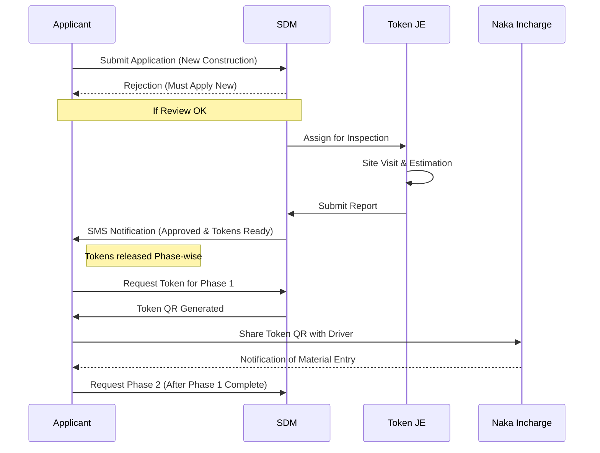

# Applicant (Citizen) Feature Set and APIs

## User Persona
**Profile:** Property owners, contractors, builders
**Access:** Mobile App, Website
**Authentication:** Mobile OTP + Aadhaar verification

## Feature Set

1.  **Account Management**
    *   OTP-based registration and login
    *   Aadhaar verification for identity proof
    *   Profile management (Address, Contact details)

2.  **Application Management**
    *   **New Application:** Submit applications for New Construction or Renovation in specific zones (`UIT_DENSE`, `UIT_SCATTERED`, `ULB_DENSE`, `ULB_SCATTERED`).
    *   **Form Fill-up:** Dynamic forms based on construction type.
    *   **Document Upload:** Upload required documents (Ownership deed, Maps, etc.).
    *   **Tracking:** Real-time status tracking of applications with a visual timeline.
    *   **Rejection Protocol:** If an application is rejected by the SDM, it cannot be edited. The applicant must submit a **completely new request**.

### Application Workflow (Applicant View)

3.  **E-Token Management**
    *   **Phased Release:** tokens are released one phase at a time (Max 5 phases).
    *   **View Tokens:** Access issued digital tokens for current phase.
    *   **Token Details:** View phase-wise material limits and remaining quantities.
    *   **Share Token:** Share verification links/QRs with drivers via SMS/WhatsApp.
    *   **Usage History:** Track material entry logs against each token.

4.  **Notifications**
    *   Receive alerts for application status changes, token generation, and low balance.

## Related APIs

### Authentication
*   `POST /auth/login` - Initiate login with mobile number
*   `POST /auth/verify-otp` - Verify OTP and get access token
*   `POST /auth/aadhaar-verify` - Verify Aadhaar number
*   `POST /auth/refresh` - Refresh access token
*   `POST /auth/logout` - Logout

### User Profile
*   `GET /users/profile` - Get profile details
*   `PUT /users/profile` - Update profile information

### Applications
*   `POST /applications` - Create new application
*   `GET /applications` - List all submitted applications
*   `GET /applications/:id` - Get application details including timeline
*   `PUT /applications/:id` - Update application (if allowed/requested)
*   `POST /applications/:id/documents` - Upload documents
*   `GET /applications/:id/timeline` - Get specific timeline events

### Tokens
*   `GET /tokens` - List all issued tokens
*   `GET /tokens/:id` - Get details of a specific token
*   `POST /tokens/:id/share` - Share token with a driver
*   `GET /tokens/:id/usage` - View usage history of a token
*   `GET /tokens/:id/qr` - Generate/View QR code

### Notifications
*   `GET /notifications` - List user notifications
*   `PUT /notifications/:id/read` - Mark notification as read
*   `PUT /read-all` - Mark all notifications as read
