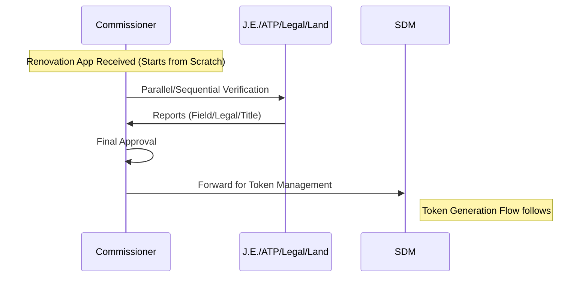

# CMS (Commissioner) Feature Set and APIs

## User Persona
**Role:** Commissioner (UIT / ULB)
**Department:** Urban Improvement Trust / Urban Local Body
**Access:** Web Dashboard
**Authentication:** Email + Password + OTP

## Feature Set

1.  **Application Processing**
    *   **Renovation Approval:** Final authority for Renovation applications.
    *   **Additional Material:** Approve requests for additional material on existing tokens.
    *   **Review:** Review and process files forwarded by lower authorities.

### Renovation Approval Workflow

2.  **Blacklist Management**
    *   **Whitelist Users:** Authority to whitelist blacklisted citizens (shared with SDM).

3.  **Dashboard & Reporting**
    *   **Performance Monitoring:** Monitor team performance and file pendency.
    *   **Reports:** Access detailed reports relevant to UIT/ULB.

## Related APIs

### Application Management
*   `GET /applications` - View file queue
*   `GET /applications/:id` - View application details
*   `POST /applications/:id/approve` - Approve Renovation/Additional Material
*   `POST /applications/:id/reject` - Reject application
*   `POST /applications/:id/forward` - Forward application

### Blacklist Management
*   `GET /blacklist` - View blacklisted users
*   `POST /blacklist/:userId/whitelist` - Whitelist a user

### Reporting
*   `GET /reports/applications` - Application reports
*   `GET /reports/materials` - Material consumption reports
*   `GET /analytics/performance` - Performance metrics
