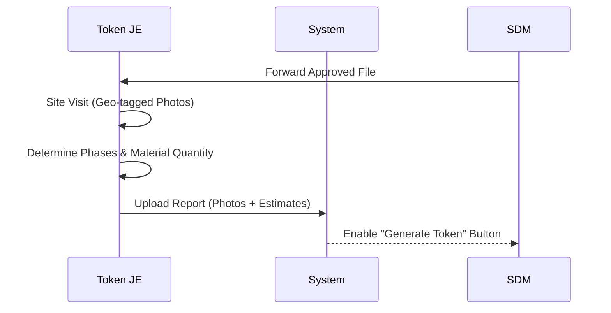

# JEN (Junior Engineer) Feature Set and APIs

## User Persona
**Role:** Technical Verification / Field Officer
**Department:** Engineering / PWD
**Access:** Mobile App (Field) / Web Dashboard
**Authentication:** Email + Password + OTP

## Feature Set

1.  **Site Inspection**
    *   **Field Visits:** Visit construction sites for physical verification.
    *   **Geo-tagged Photos:** Upload mandatory geo-tagged photos of the site (`Before`, `During`, `After` construction).
    *   **GPS Validation:** System must validate that image metadata contains GPS coordinates matching the site location within a defined radius.
    *   **Layout Verification:** Verify if the actual site matches the submitted layout plan.

2.  **Estimation**
    *   **Material Estimation:** Calculate and upload phase-wise material estimates.
    *   **Excel Upload:** Support for uploading estimates via Excel templates.
    *   **Final Authority:** J.E. estimates are final and supersede user estimates.

### Inspection & Estimation Workflow (New Construction)

3.  **Reporting**
    *   **Forward Report:** Submit inspection report and estimates to SDM/CMS for final approval.

4.  **Complaint Redressal**
    *   **Assignment:** Receive complaints based on assigned category.
    *   **Resolution:** Resolve issue and upload **Mandatory Resolution Photo**.

## Related APIs

### Application & Task Management
*   `GET /applications` - View assigned applications for inspection
*   `GET /applications/:id` - View application details

### Inspections
*   `POST /inspections` - Create a new inspection report
*   `POST /inspections/:id/photos` - Upload geo-tagged site photos (Validates `EXIF` GPS data)
*   `PUT /inspections/:id` - Update inspection status

### Estimates
*   `POST /estimates/upload` - Upload material estimate (Excel)
*   `PUT /estimates/:id` - Update estimate details
*   `GET /estimates/:applicationId` - View existing estimates

### Workflow
*   `POST /applications/:id/forward` - Forward application with inspection report to SDM/CMS
