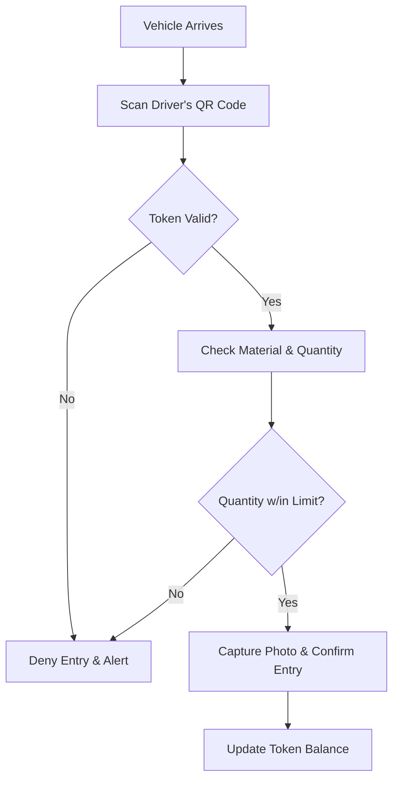

# Naka Incharge (Checkpoint Officer) Feature Set and APIs

## User Persona
**Role:** Checkpoint Verification
**Department:** Security / Enforcement
**Access:** Mobile App
**Authentication:** Email + Password + OTP

## Feature Set

1.  **Entry Verification**
    *   **QR Scanning:** Scan driver's E-Token QR code to validate permission.
    *   **Validation:** System automatically checks validity, expiry, and material balance.
    *   **Manual Override:** (Strictly controlled) log entry if scanner fails.

### Token Verification Flow

2.  **Entry Logging**
    *   **Log Details:** Record vehicle number, driver details, and actual material quantity entering.
    *   **Photo Evidence:** Capture photo of the vehicle/material at the checkpoint.
    *   **Geo-tagging:** Automatic location tagging of the entry log.

3.  **History**
    *   **Recent Entries:** View history of vehicles passed through the specific Naka.

## Related APIs

### Token Scanning & Entry
*   `POST /naka/scan` - Scan QR code and validate token
*   `POST /naka/entries` - Log a verified entry (deduct material balance)
*   `POST /naka/entries/:id/photos` - Upload evidence photos for the entry

### History
*   `GET /naka/entries` - List entries logged by this user/naka
*   `GET /naka/entries/:id` - View details of a specific entry
