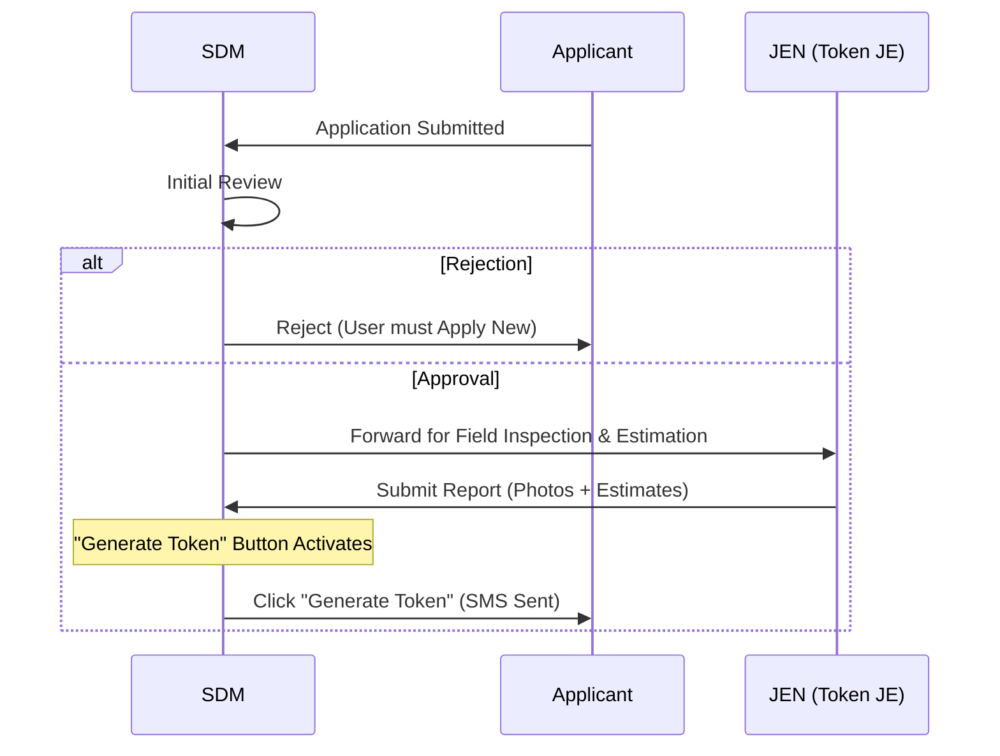

# SDM (Sub-Divisional Magistrate) Feature Set and APIs

## User Persona
**Role:** Final Authority / Admin
**Department:** Revenue / Administration
**Access:** Web Dashboard
**Authentication:** Email + Password + OTP

## Feature Set

1.  **Application Processing**
    *   **Final Approval:** Review and grant final approval for New Construction files.
    *   **Rejection:** Reject applications with comments and reasons.
    *   **Grant E-Tokens:** Automated token generation upon final approval.
    *   **Forwarding:** Forward files to other departments (JEN, Land, etc.) if needed.

### Approval Workflow (New Construction)

2.  **User & Authority Management (Admin)**
    *   **Create Authority:** Create accounts for other officers (JEN, Naka Incharge, etc.).
    *   **Manage Authority:** specific view/edit access for authority accounts.
    *   **Whitelist Users:** Review and whitelist blacklisted citizens.

3.  **Dashboard & Reporting**
    *   **Performance Dashboard:** View system-wide metrics (Processing time, Pending files).
    *   **Analytics:** detailed reports on applications, material usage, and authority performance.
    *   **Audit Logs:** View audit trails of system actions.

4.  **Content Management**
    *   Manage public website content (Notices, Tenders).

## Related APIs

### Application Management
*   `GET /applications` - View file queue (filter by status/assigned)
*   `GET /applications/:id` - View full application details
*   `POST /applications/:id/approve` - Approve and generate tokens
*   `POST /applications/:id/reject` - Reject application
*   `POST /applications/:id/forward` - Forward to another authority

### Authority Management (Admin)
*   `GET /users/authorities` - List all system authorities
*   `POST /users/authorities` - Create a new authority user
*   `PUT /users/authorities/:id` - Update authority details

### Blacklist Management
*   `GET /blacklist` - View blacklisted users
*   `POST /blacklist/:userId` - Manually blacklist a user
*   `POST /blacklist/:userId/whitelist` - Whitelist a user

### Reporting & Analytics
*   `GET /reports/applications` - Application statistics
*   `GET /reports/tokens` - Token usage statistics
*   `GET /reports/authority-performance` - SLA reports
*   `GET /analytics/overview` - Dashboard overview

### Website CMS
*   `POST /content/notices` - Publish notices
*   `POST /content/tenders` - Publish tenders
