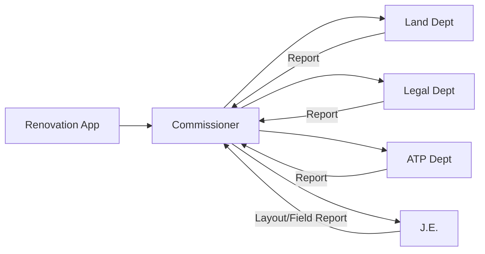

# Verification Authority (Land, Legal, ATP) Feature Set and APIs

## User Persona
**Roles:**
*   **Land Dept:** Land ownership verification.
*   **Legal Dept:** Legal clearance and dispute checking.
*   **ATP (Town Planning):** Master plan compliance verification.
**Access:** Web Dashboard
**Authentication:** Email + Password + OTP

## Feature Set

1.  **Document Verification**
    *   **Review:** Examine uploaded documents specific to their department (e.g., Deeds for Land, Maps for ATP).
    *   **Checklist:** Complete a mandatory verification checklist.
    *   **Comments:** Add specific observations or objections.

### Verification Matrix (Renovation)

2.  **Workflow Actions**
    *   **Forward:** Submit report back to Commissioner (CMS).
    *   **Reject:** Reject the application if documents are invalid or missing.

## Related APIs

### Application Management
*   `GET /applications` - View assigned applications
*   `GET /applications/:id` - View application details and documents
*   `POST /applications/:id/forward` - Approve verification and forward
*   `POST /applications/:id/reject` - Reject application with reasons

### Documents
*   `GET /applications/:id/documents` - View/Download documents
